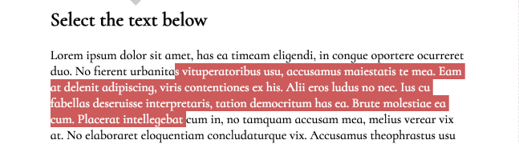

[Table of Contents](/README.md)

# Day 03

## Review
- css selector specificity
	- which css rule will win in a competition over styling a single element?
	- the closer the rule is (physically) to the element the more likely it will win
	- id > class > tagname (usually we use a combo of class (`.octocat`) and tag (`ul`))
	- combining css selectors to make more specific selectors
		- combining `li.octocat` will target elements that have ALL the properties in the selector, by not using spaces
		- descendent selectors (space character) `li .octocat` will select any elements with the class of octocat that are nested inside an li. `.authors img`
		- child selectors `>` the same as descendent only it only applies to first level children `.octocat > img` selects any images that are first tier children of the octocat class
- difference between float and flex and inline-block and positioning
	- inline-block is great for when you want a block level element to be treated as if it is just like text, but still want some control over it's sizing
	- floats are more or less the common standard for creating layouts, so get comfortable with them! Don't forget to make sure parents of floated children know where their children are (use clearfix hack)
	- flex is newer and not totally accepted by the industry yet, so make sure you are confident with floats and inline-block before you pursue it!
	- positioning - i don't think of positioning as a layout tool (tho obviously it is). i use it ONLY as a last resort when there is NO OTHER WAY to get elements to do what i want

## Challenge
Recreate the following using HTML and CSS. You can use Codepen, and work in pairs. (don't worry about that box that says "rerun" on the right side, but do worry about the color of the highlighting!)

## Notes
- length units
	- `px` pixels one square on the screen
	- `%` for widths % refers to the parent element's width
	- `em` font size of the element
	- `rem`	 font size of the whole document
	- `vh` `vw` like % but always referring to the "viewport" (w is width, h is height)
- color units
	- `pink` color names
	- hex value `#ad342f`
	- rgb `rgb(255, 0, 0)`
	- rgba `rgba(255, 0, 0, .5)` the a value is transparency
- vertical align
 	- only works for inline or inline-block elements
	- all inline elements within a container will compare their line-height to the other inline elements in the container. the tallest one is the comparator.
	- they will align themselves to that element using vertical align.
	- by default it is set to 'baseline' which is just above the bottom of a line (where the bottom of capital letters rest)
- css reset/normalize
	- css stylesheet that creates consistent baselines styles for all browsers
	- does not get rid of generic styles, just makes them consistent
	- prefer using a CDN
		- content delivery network
		- caching and distribution of host
- pseudo selectors
	- denoted by 1 `:` such as `a:hover {}`
	- for state such as hover, active (when you are actively clicking a link), visited (for links you've been to before), focus (for form elements that are currently selected)
	- also for selecting a sub group of elements such as
		- `:first-child`
		- `:nth-child(2n + 1)`
- css positioning
	- default value of `position: static`
	- other options:
		- `relative` - still takes up it's normal space, BUT will move around from that location using top left bottom and right positions
		- `fixed`
		 	- completely out of the page flow, doesn't take up space anymore
			- shrinks to the size of its contents, no longer full width
			- sticks to the view port, NOT the document
			- top left bottom right refer to distance of corresponding edge from the viewport
		- `absolute`
			- moved relative to something other than itself.
			- out of the flow of the page, doesn't take up normal space anymore
			- shrinks to the size of its contents, no longer full width.
			- top left bottom right refer to the NEAREST PARENT that is NOT STATIC (if there isn't one it will be the body)
- pixel perfect
	- the concept that your web project is exactly the same, down to the pixel, as the original designed image.
	
## Resources
