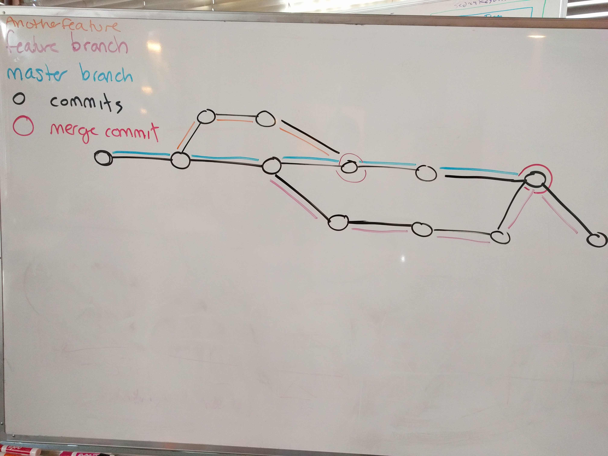
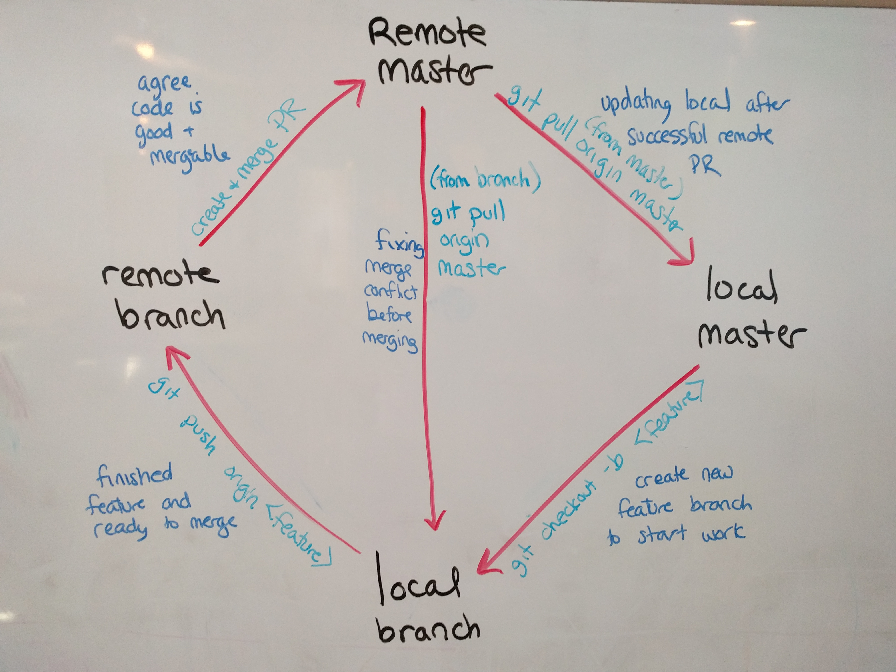

[Table of Contents](/README.md)

# Day 08

## Review
- Don't forget to use CSS resets (like normalize)

## Challenge
no challenge today, so much material!!

## Notes
- CSS transitions
	- anytime we want the browser to change from one property value to another, it will take a specified time to do so.
	- only works with "transitionable" properties. these properties are ones whose values are smooth from one to another.
	```css		
	selector {
		transition: propertyName 5s;
	}
	```

- mixin libraries / grid frameworks
	- libraries are available open source or paid for projects that we can incorporate into our own project, and not have to re-write code that has already been written
 	- in sass, we can use a mixin library to use someone else's mixins.
	- bourbon
		- one time only `sudo gem install bourbon`
		- every project you want to use it in:
			- got to styles folder
			- `bourbon install`
			- import the bourbon partial into your main sass file before any other partials that might use bourbon.
	- grid frameworks
		- break design down into columns with "gutters" between them to keep uniformed spacing on the page.
		- popular examples are bootstrap, neat, foundation, material, etc.
		- neat
			- i like neat because it is all done in css, without adding class names to your html.
			- install is basically the same, but with 'neat' instead of 'bourbon'
			- to use, import AFTER bourbon. (neat depends on bourbon, so you must also import that)
			- you must include an "outer-container" somewhere in your project
				- you may have multiple outer containers but NOT nested within one another
			- within an outer container, you can make your elements span a certain number of columns using the "span-columns" mixin.
			- by default a grid is 12 columns wide.
			```scss
			main {
				@include outer-container(75%)
			}

			.primary-post {
				@include span-columns(9);
			}

			.sidebar {
				@include span-columns(3);
			}
			```

- git branches
	
	- branches should be used to work on features.
	- the master branch should be reserved for functional, live code.
	- create and go to a new branch like this: `git checkout -b branch-name`
	- go to an existing branch like this: `git checkout branch-name`
	- when you switch branches you will be taken to the most recent commit that was flagged as apart of that branch. your files will reflect the state of work at the time the commit was made.
	- to merge a branch (locally): `git merge name-of-other-branch`
		- you may have to fix merge conflicts
		- you will make a new commit that is shared by both branches (the one you were on, and the other one you merged in)
- github group project flow
	
	- one person makes local and origin repo on github
	- add collaborators to the project on github, and collabs, accept the invitation
	- collaborators clone the git repository from github to their machine.
		- `git clone remote-address local-folder-path-for-project`
		- git will create a local copy of the project in local-folder-path-for-project and set up the remote origin.
	- everyone! checkout a new branch to work on a feature!
		- still do what you normally do, in terms of sass watching
	- when you finish a feature and want to share your code back into master and with everyone else:
		- `git push origin feature-branch-name`
		- go onto github, and make a pull request on the code you just pushed up.
		- if you notice there is a merge conflict, fix it! (see below)
		- tell your teammates you made a pull request and ask for them to provide feedback/approve
		- after everyone agrees, merge the code using github's merge button
		- checkout the master branch locally.
		- `git pull origin master`
		- make a new feature branch and start again.
	- fixing a merge conflict
		- if you notice your code is not mergeable, while on your local branch run `git pull origin master`.
		- you will be notified of merge conflicts. you will be notified which files contain those conflicts.
		- go into the files with conflicts and edit the code so that it looks right again.
		- save, `git add .`, `git commit -m 'fixed merge conflicts in ...'`, `git push origin branch-name`
		- tell your teammates you fixed the merge conflicts and are ready for code review.

## Resources
[Bourbon Docs](http://bourbon.io/docs/)
[Neat Docs](http://neat.bourbon.io/examples/)
